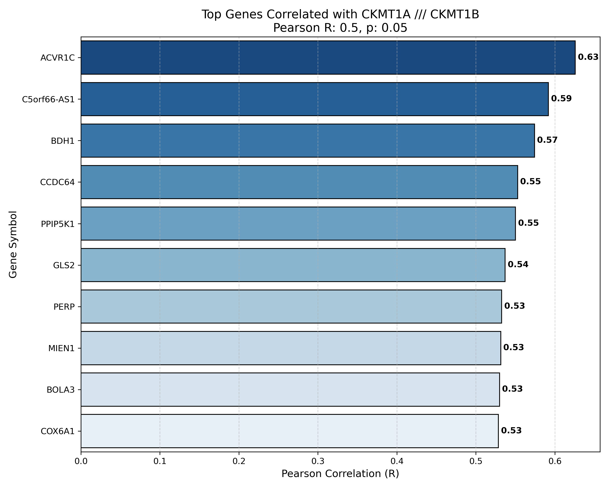
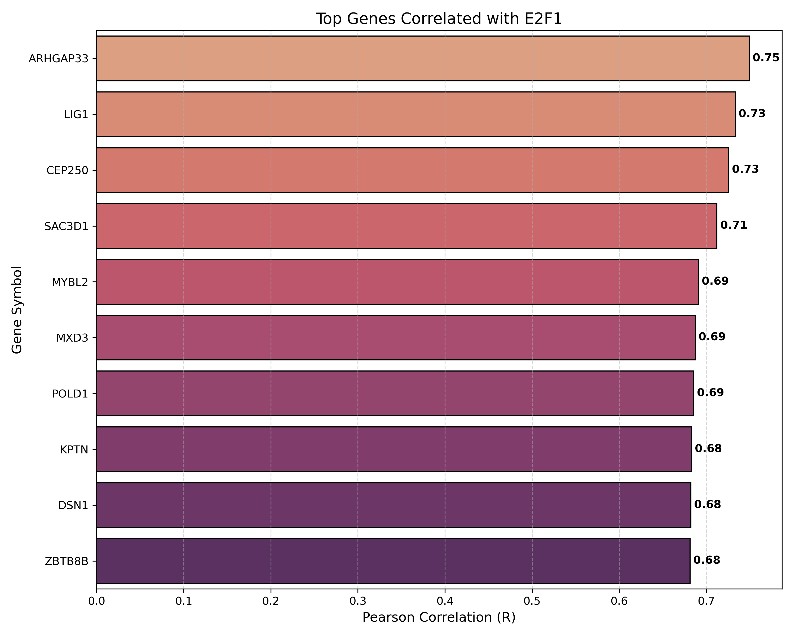
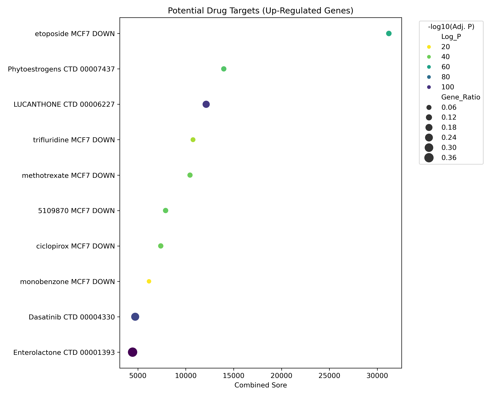
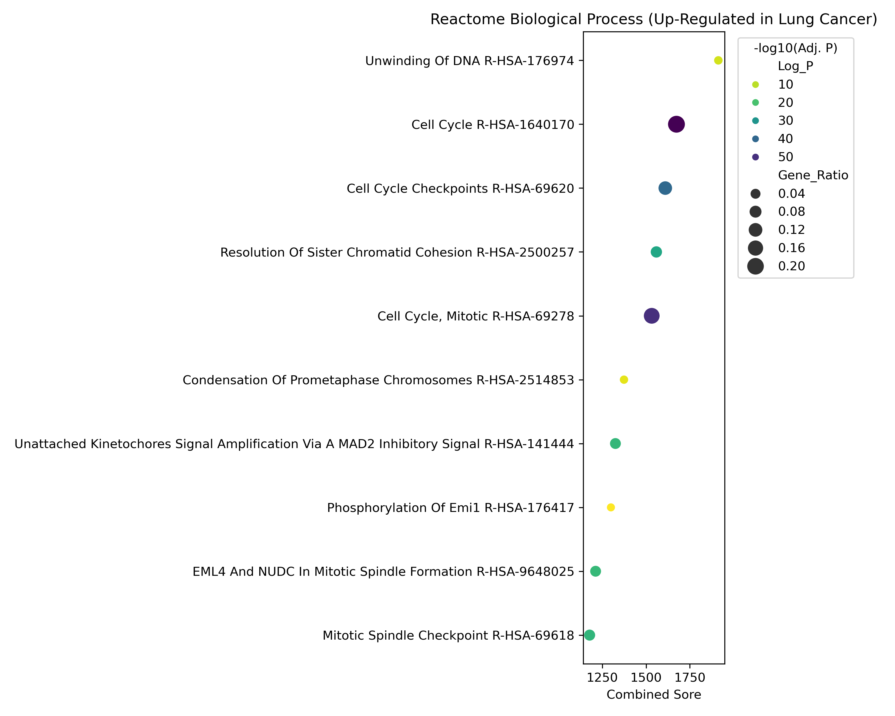

# gse19188_figures

**Figure 1.** CKMT1A gene expression correlations (Pearson correlation).

**Figure 2.** E2F1 gene expression correlations (Pearson correlation).

**Figure 3.** Principal Component Analysis (PCA): PC1 vs PC2.

**Figure 4.** Principal Component Analysis (PCA): PC1 vs PC3.

**Figure 5.** PCA scree plot showing variance explained by each principal component.

**Figure 6.** Volcano plot of differentially expressed genes.

**Figure 7.** Drug–target interaction network for significantly expressed genes.

**Figure 8.** Pearson correlation between E2F1 and MYBL2 expression.

**Figure 9.** GO biological process enrichment analysis of downregulated genes.

**Figure 10.** GO biological process enrichment analysis of upregulated genes.

**Figure 11.** Overall GO biological process enrichment analysis.

**Figure 12.** Heatmap of differentially expressed genes.

**Figure 13.** KEGG pathway enrichment analysis of downregulated genes.

**Figure 14.** KEGG pathway enrichment analysis of upregulated genes.

**Figure 15.** Reactome pathway enrichment analysis.

